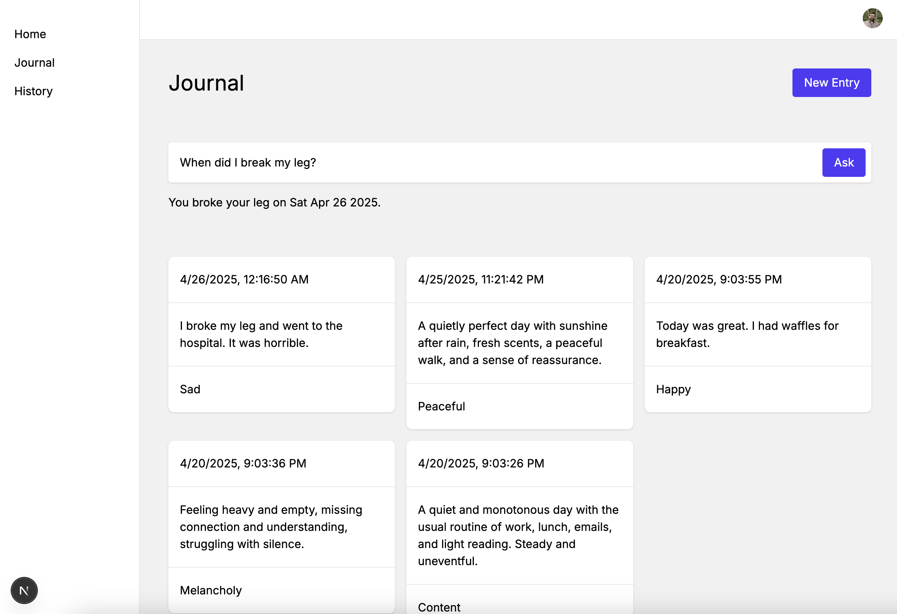
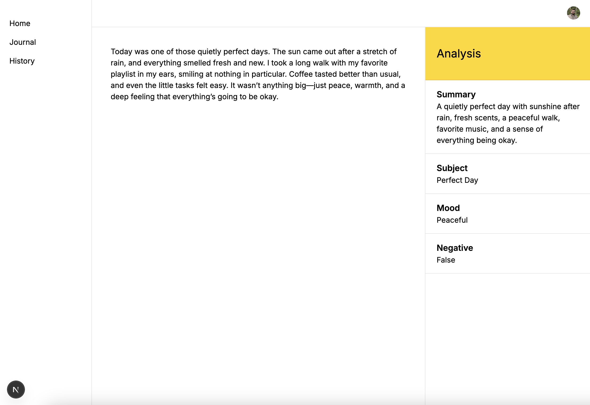
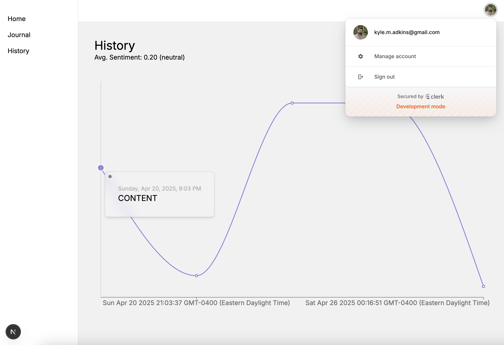

## Overview

ReflectAI is a journaling application that does real-time sentiment analysis on your entries using LangChain.js and OpenAI. I used [Zod](https://zod.dev) to generate structured output from the LLM

## Running the project

You'll need an account on [Clerk](https://clerk.com) and [OpenAI](https://openai.com)

Once you have those accounts, create the following .env.local file with your credentials

```
NEXT_PUBLIC_CLERK_PUBLISHABLE_KEY=<Clerk public key>
CLERK_SECRET_KEY=<Clerk secret key>
SIGNING_SECRET=<Clerk signing secret>

NEXT_PUBLIC_CLERK_SIGN_IN_URL=/login
NEXT_PUBLIC_CLERK_SIGN_UP_URL=/register

OPENAI_API_KEY=<OpenAI key>
```

And then create the following .env file

```
DATABASE_URL=<database URL>
```

I used [Neon](https://neon.tech) for my database

You'll need to push the [Prisma](https://www.prisma.io) schema to your database using the following command

```
npm install
npx prisma db push
```

After you've done all that, you should be able to run the dev server

```bash
npm run dev
```

## Screenshots

If you don't want to run the project yourself, here are some screenshots

### Journal



### Entry



### History


